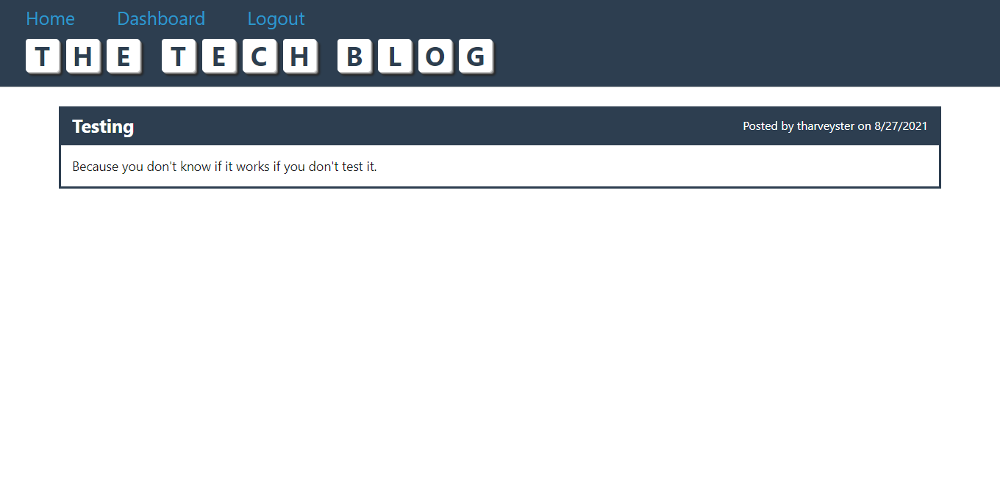

# Tech Blog

## Description
This project is a technology blog that allows users to create accounts, view posts created by other users, create, update, and delete their own posts, and comment on other user's posts. It was created using HTML, CSS, JavaScript, Node.js, Express.js, Handlebars.js, MySQL, BCrypt, Sequelize, and Sequelize Session.

## Screenshot

## Questions
If you have questions about this repo, open an issue or contact me directly at todd@weloveeats.com. You can find more of my work at [tharveyster](https://github.com/tharveyster).

## License
ISC

Copyright 2021 Todd Harvey

Permission to use, copy, modify, and/or distribute this software for any purpose with or without fee is hereby granted, provided that the above copyright notice and this permission notice appear in all copies.

THE SOFTWARE IS PROVIDED "AS IS" AND THE AUTHOR DISCLAIMS ALL WARRANTIES WITH REGARD TO THIS SOFTWARE INCLUDING ALL IMPLIED WARRANTIES OF MERCHANTABILITY AND FITNESS. IN NO EVENT SHALL THE AUTHOR BE LIABLE FOR ANY SPECIAL, DIRECT, INDIRECT, OR CONSEQUENTIAL DAMAGES OR ANY DAMAGES WHATSOEVER RESULTING FROM LOSS OF USE, DATA OR PROFITS, WHETHER IN AN ACTION OF CONTRACT, NEGLIGENCE OR OTHER TORTIOUS ACTION, ARISING OUT OF OR IN CONNECTION WITH THE USE OR PERFORMANCE OF THIS SOFTWARE.
